# camera_related_practices
## gradient_magnitude
### original image

### gaussian smoothing

### horizontal gradient
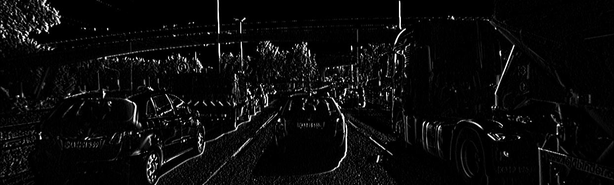

### vertical gradient

### gradient magnitude
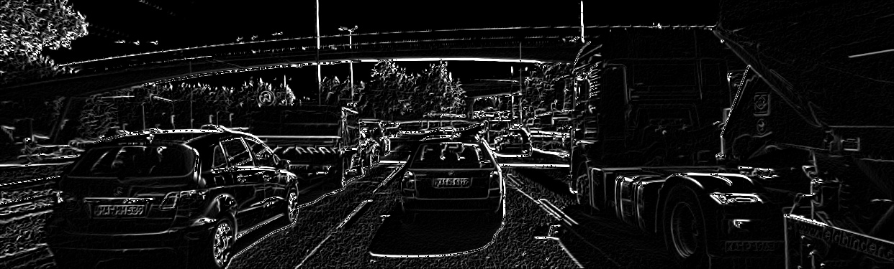

### gradient magnitude with smoothing
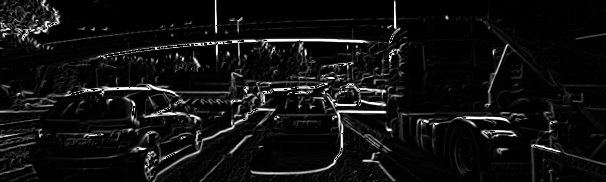

## harris_corner
### corner response map
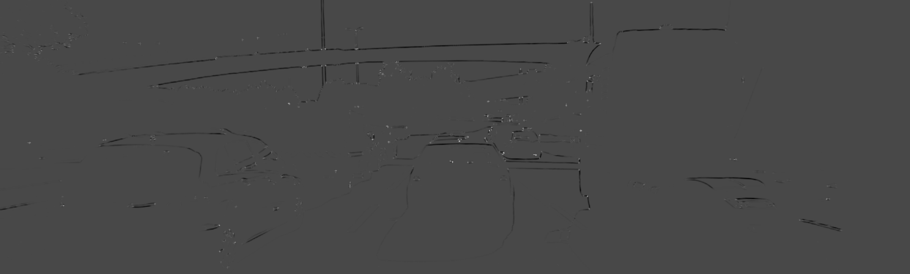

### harris corner
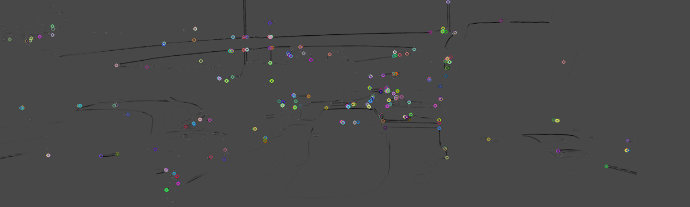

### harris corner with non-maximum suppression
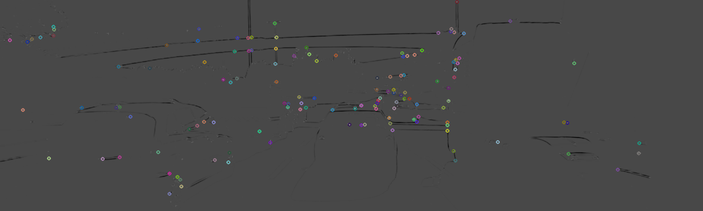

## keypoint_detector
### SIFT keypoints
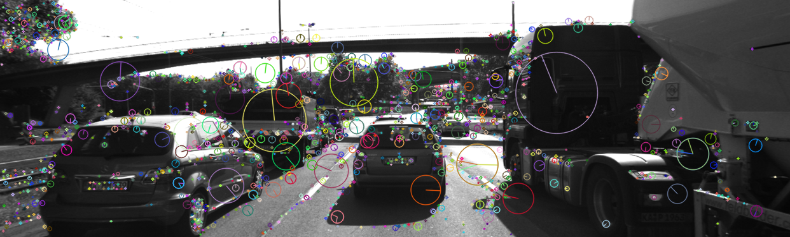
### BRISK keypoints
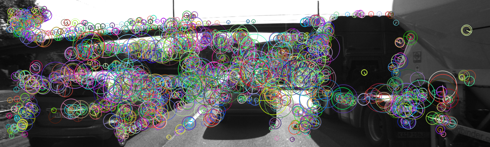
### ORB keypoints
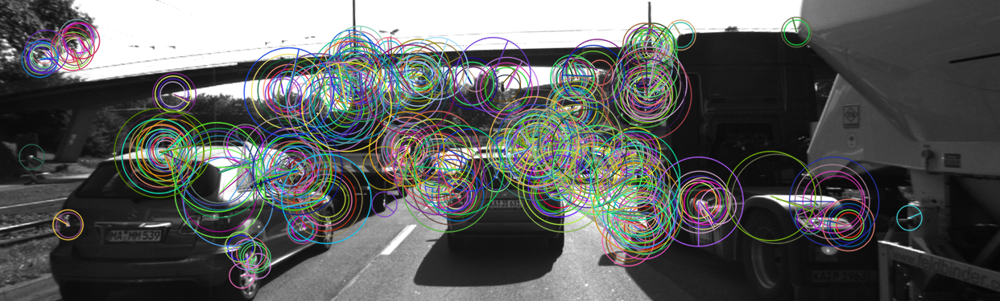

## keypoint_descriptor
### SIFT keypoints
Each SIFT keypoint is associated with a 128-dimensional feature descriptor.

[43, 25, 3, 6, 2, 2, 3, 14, 49, 13, 0, 0, 0, 24, 76, 45, 2, 2, 2, 1, 6, 65, 77, 9, 0, 4, 15, 6, 12, 21, 1, 0, 90, 21, 2, 3, 10, 13, 1, 9, 160, 24, 1, 3, 12, 41, 79, 160, 24, 3, 1, 8, 160, 160, 94, 45, 0, 0, 0, 6, 83, 37, 0, 0, 81, 25, 2, 13, 18, 3, 0, 4, 160, 160, 7, 12, 19, 6, 2, 28, 41, 39, 8, 31, 160, 38, 3, 8, 0, 0, 0, 3, 49, 6, 0, 0, 8, 9, 1, 4, 11, 1, 0, 0, 33, 33, 0, 0, 0, 0, 0, 0, 2, 4, 0, 0, 1, 0, 0, 0, 0, 0, 0, 0, 0, 0, 0, 0]
### BRISK keypoints
Each BRISK keypoint is associated with a 64-dimensional feature descriptor, and every element represents 8 bit, the result is a 512-bit binary array.

[180, 59, 255, 239, 231, 194, 1, 0, 131, 0, 0, 224, 112, 223, 255, 255, 255, 255, 255, 97, 8, 131, 48, 111, 231, 15, 96, 218, 121, 239, 29, 131, 63, 255, 255, 255, 255, 255, 243, 24, 0, 128, 152, 229, 115, 38, 33, 140, 223, 131, 96, 242, 251, 255, 251, 255, 223, 104, 100, 0, 0, 32, 97, 2]
### ORB keypoints
Each ORB keypoint is associated with a 32-dimensional feature descriptor, and every element represents 8 bit, the result is a 256-bit binary array.

[193, 249, 27, 113, 169, 221, 53, 166, 236, 105, 102, 24, 182, 148, 0, 48, 128, 30, 104, 64, 67, 189, 176, 35, 229, 225, 48, 51, 64, 16, 199, 251,]

## keypoint_matcher
### FLANN with nearest neighbor 
500 matches.
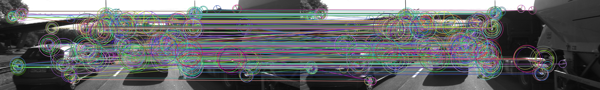

### FLANN with 2 nearest neighbor and 0.8 distance ratio
355 matches.
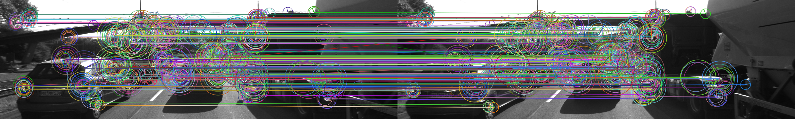

## lidar_to_camera_projection
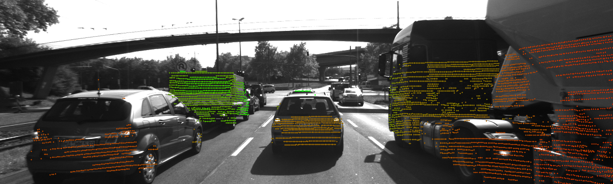

## object_detection
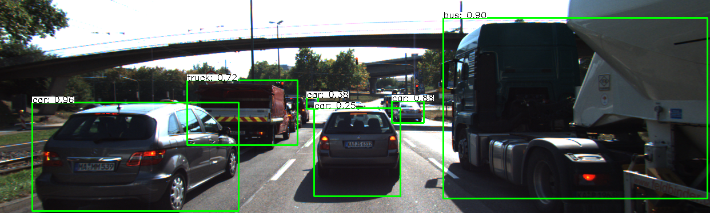