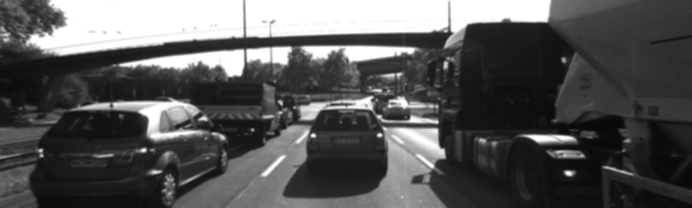
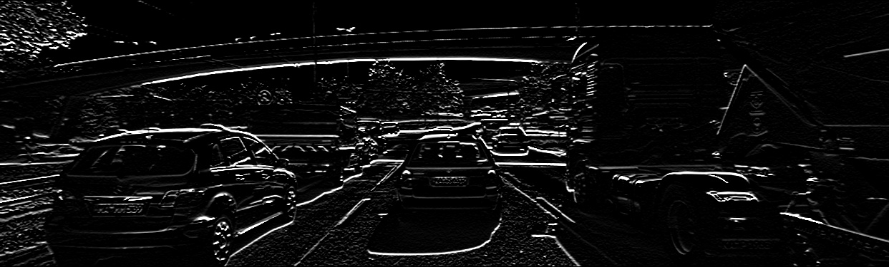

# camera_related_practices
## gradient_magnitude
### original image

### gaussian smoothing

### horizontal gradient

### vertical gradient

### gradient magnitude

### gradient magnitude with smoothing

## harris_corner
### corner response map

### harris corner

### harris corner with non-maximum suppression
